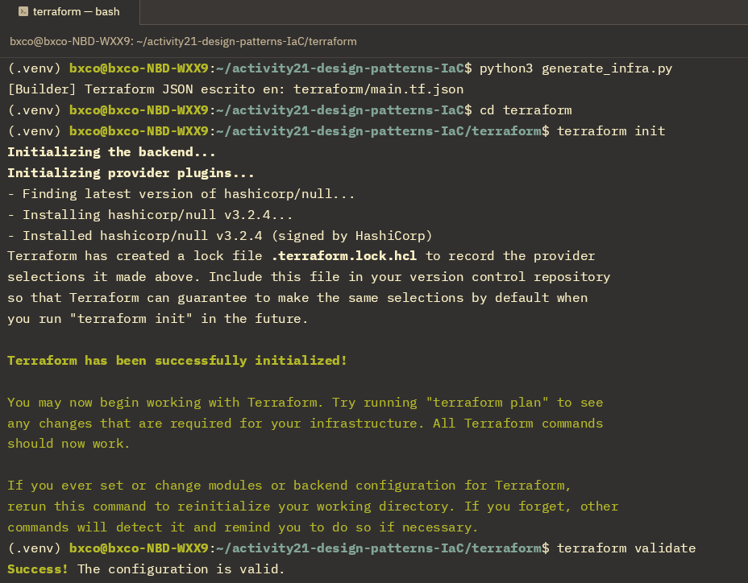
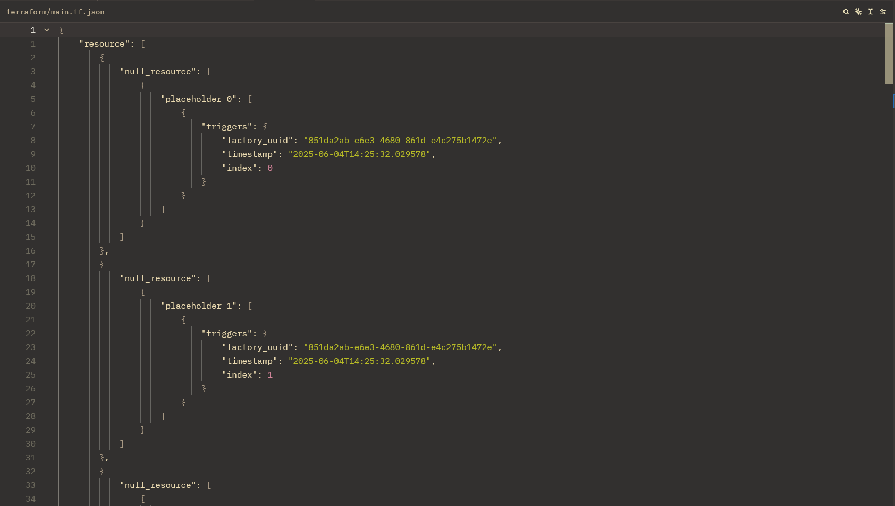

# Actividad 21: Patrones para módulos de infraestructura

En esta actividad:
1. Profundizaremos en los patrones **Singleton**, **Factory**, **Prototype**, **Composite** y **Builder** aplicados a IaC.
2. Analizaremos y extenderemos el código Python existente para generar configuraciones Terraform locales.
3. Diseñaremos soluciones propias, escribir tests y evaluar escalabilidad.

## Fase 0: Preparación
Clonamos para esta actividad el siguiente [proyecto](https://github.com/kapumota/DS/tree/main/2025-1/local_iac_patterns) como referencia.
Como parte del proyecto se configuro el respectivo entorno virtual y se procedió inmediatamente a generar la infraestructura base y valida ccon los siguientes comandos:

   ```bash
   python generate_infra.py
   cd terraform
   terraform init
   terraform validate
   ```



Finalmente podremos inspeccionar dentro de nuestro archivo `terraform/main.tf.json` para visualizar los recursos del tipo `null_resource` creados.


